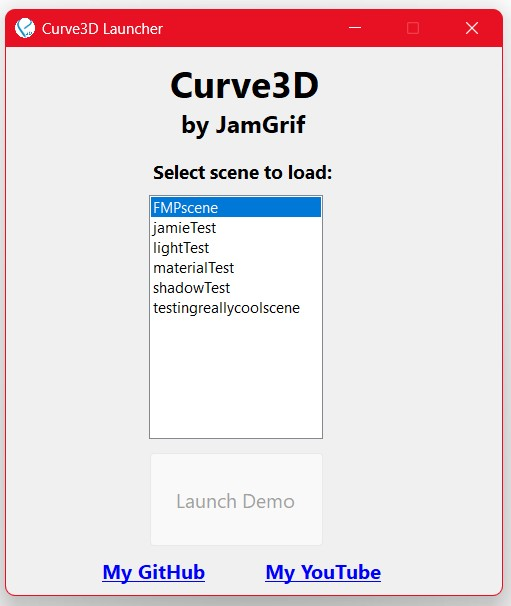

# Curve3D  

The goal of Curve3D is to build a simple level editor within a lightweight C++ 3D OpenGL engine. This project is a continuation of a [**previous engine**](https://github.com/JamGrif/OpenGLProject) and makes use of a variety of external libraries to achieve this goal. 

Curve3D features a collection of 3D graphics features and operates by parsing a custom *.xml* scene file containing all the required components of a 3D scene. The engine is launched via **Curve3DLauncher**, a C# WinForms application that allows users to configure launch parameters, such as the initial scene to load.  

This project serves as a personal experiment, with the aim of further developing my knowledge of OpenGL, modern C++, C# and mathematics, while also improving my overall software design skills.  

    
# Features
- ADS Blinn-Phong light reflection model  
- Diffuse, specular, emission, height and normal texture maps  
- Multithreaded asset deserialisation  
- Material system that combines texture, mesh, shader and cubemap files  
- Runtime scene loading from custom *.xml* files  
- Support for loading external 3D models, textures and shaders    
- ImGui interface with an integrated scene editor 
    - Change scenes
    - Adjust light states
    - View and delete entities
- WinForms launcher for setting initial program parameters  
- Console-based logging system for error handling  
- Coloured lighting from directional, point and spot lights  
- Skybox cubemap support  
- Reflection and refraction environment mapping  
- Mouse and keyboard input with full camera movement on all three axes  

**OLD** Project Showcase Video - https://www.youtube.com/watch?v=QOnscYxgrNQ

## **Curve3D uses the following dependencies:**

[assimp](https://github.com/assimp/assimp)

[GLEW](https://github.com/nigels-com/glew)

[GLFW](https://github.com/glfw/glfw)

[glm](https://github.com/g-truc/glm)

[imgui](https://github.com/ocornut/imgui)

[spdlog](https://github.com/gabime/spdlog)

[stb_image](https://github.com/nothings/stb)
